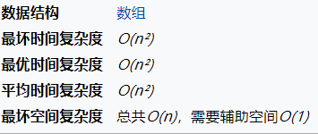

# 排序
## 1 插入排序
### 1.1 直接插入排序
### 1.2 折半插入排序
### 1.3 希尔排序
## 2 快速排序（交换）
### 2.1 冒泡排序
        

+ 特点：<font color = red>**从后往前排**</font>
```c
void bubbleSort (int arr[], int len)
{

	int i, j,temp;
	Boolean exchanged = true;
	
	for (i=0; exchanged && i<len-1; i++) /* 外迴圈為排序趟數，len個數進行len-1趟,只有交換過,exchanged值為true才有執行迴圈的必要,否則exchanged值為false不執行迴圈 */
		for (j=0; j<len-1-i; j++) 
		{ /* 內迴圈為每趟比較的次數，第i趟比較len-i次  */
		
		exchanged = false;
		
			if (arr[j] > arr[j+1])
			{ /* 相鄰元素比較，若逆序則互換（升序為左大於右，逆序反之） */
				temp = arr[j];
				arr[j] = arr[j+1];
				arr[j+1] = temp;
				exchanged = true; /*只有數值互換過, exchanged才會從false變成true,否則數列已經排序完成,exchanged值仍然為false,沒必要排序 */
			}
		}
}
```
### 2.2 快速排序
+ 快速排序的核心思想是设定一个关键值，然后让数组里的每一个大于它的元素放在它的右边，小于他的元素在左边，然后再对左边和右边这两部分再做同样的操作。
## 3 选择排序
### 3.1 选择排序
<view>
         
   
</view>   
 <view align = center>
       
 </view>    

 + 特点：<font color = red>**从前往后排**</font>
 ```c
 void selection_sort(int a[], int len) 
{
    int i,j,temp;

	for (i = 0 ; i < len - 1 ; i++) 
    {
		int min = i;
		for (j = i + 1; j < len; j++)     //走訪未排序的元素
		{
			if (a[j] < a[min])    //找到目前最小值
			{
				min = j;    //紀錄最小值
			}
		}
		temp=a[min];  //交換兩個變數
		a[min]=a[i];
		a[i]=temp;
	   	/* swap(&a[min], &a[i]);  */   //做交換
	}
}

/*
void swap(int *a,int *b) //交換兩個變數
{
    int temp = *a;
    *a = *b;
    *b = temp;
}
*/
 ```

### 3.2 堆排序
*堆排序的对象是一个一维顺序表*
+ 初始化一个堆（以大顶堆为例）：
    + 从第一个非叶子节点（如果起始位置按i = 0的位置为(n/2) - 1)开始判断其与子节点的大小关系，如果小于叶子节点，则将其与叶子节点中最大的那个进行交换。更新该结点交换后的位置，继续判断，直到其成为叶子节点或者所有叶子节点都比他小。
    + 按照一维顺序表的顺序，继续往前走，进行上一步相同的判断和操作，直到根节点。
+ 开始排序
    + 将根节点与<font color = red size = 4>**最后一个结点**</font>交换，这样最后一个结点就是<font color = gree size = 4>**定死**</font>了，可以将他看作组织外的成员了，<font color = yellow>以后的所有操作都不要找它玩了</font>。
