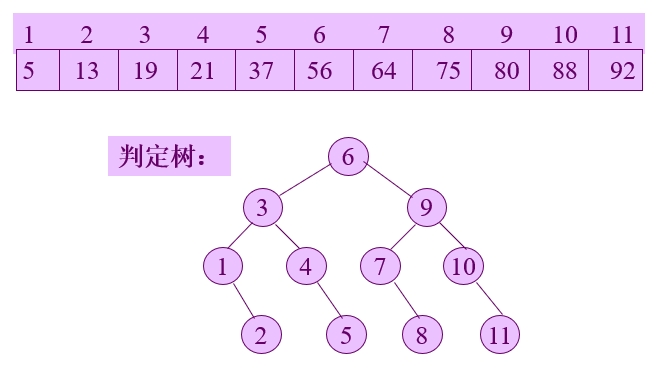
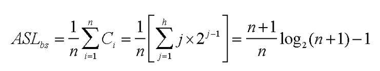
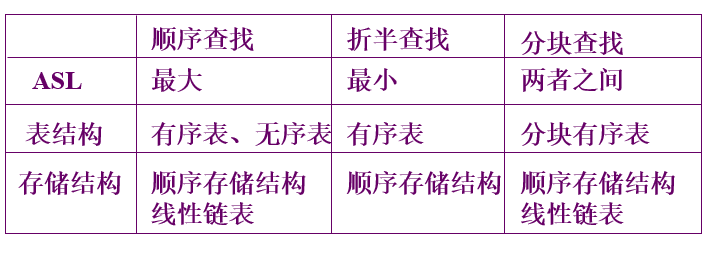
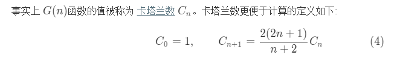
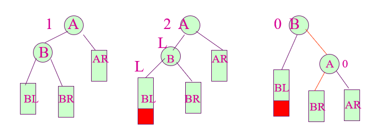
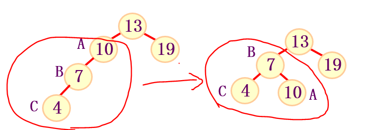
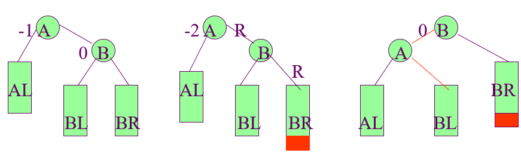
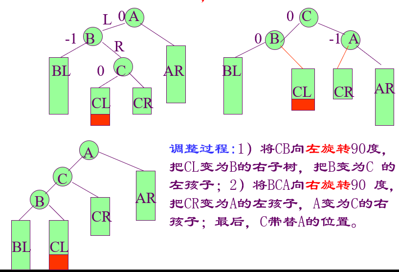
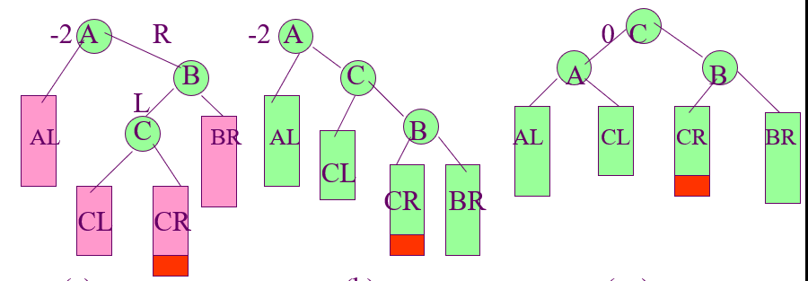

# 查找
*算法评判标准：1.查找速度；2.占用空间；3.算法复杂度；4.平均查找长度ASL(Average Search Length)*  

## 1 顺序查找
## 2 折半查找
+ **判定树**

+ **平均查找长度**

## 3 分块查找  
+ 三种查找方法比较

## 4 二叉排序树  
*<font color = gree>二叉排序树或是一棵空树，或是具有下列性质的二叉树：
若它的左子树不空，则左子树上所有结点的值均小于它的根结点的值；
若它的右子树不空，则右子树上所有结点的值均大于或等于它的根结点的值；
它的左、右子树也分别为二叉排序树</font>*
### 4.1 插入
### 4.2 删除 **<font color = red>（必须保证删除后剩余的各个数据在中序遍历的结果中的相对位置保持不变）</font>**
+ 只有左子树或者只有右子树，直接删除
+ 左右子树都存在
   + <font color = yellow>按照规则，要将删除位置p换成按中序遍历的p的前驱，那么由中序遍历的规则可知，p应该换成p的左子树按照中序遍历的最后一个结点s，沿着p的左子树根节点的右子树结点一路往右子树遍历，直到右子树为空的s结点，将s结点的值赋给p，然后将s的左子树送给s的父结点当右子树。</font>
   + <font color = yellow>如果p的左子树根节点没有右子树，则直接用p的左子树根节点替代p</font>
### 4.3 二叉排序树的个数  
+ 手动排
+ 公式法
```java
class Solution {
  public int numTrees(int n) {
    // Note: we should use long here instead of int, otherwise overflow
    long C = 1;
    for (int i = 0; i < n; ++i) {
      C = C * 2 * (2 * i + 1) / (i + 2);
    }
    return (int) C;
  }
}
```
---
## 5 平衡二叉树  
### 5.1 构建平衡二叉树时的旋转  
+ LL，左子树根节点的左子树上添加了新的结点导致平衡被打破，则对根节点A及其左子树根节点B所形成的边进行右旋，同时如果B有右子树则送给A当左子树。  
  
<font color = gree>需要注意的是，对于平衡二叉树来说，以任一一个点为根节点，得到的子树都应该为平衡二叉树，所以要先把子树调整好，如下图</font>
  
+ RR, 同理，将A——B左旋，B成为新的根节点，如果B有左子树，则送给A当右子树。
  
+ LR，左子树的右子树插入导致失衡，解决方案就是让C乱伦，把辈分排到自己的爷爷和父亲之间，然后抛弃孩子，左孩子送给没有右孩子的B，右孩子送给没有左孩子的A
  
+ RL，看图吧：
  
## 6 B-树，B+树  
## 7 哈希查找  
### 